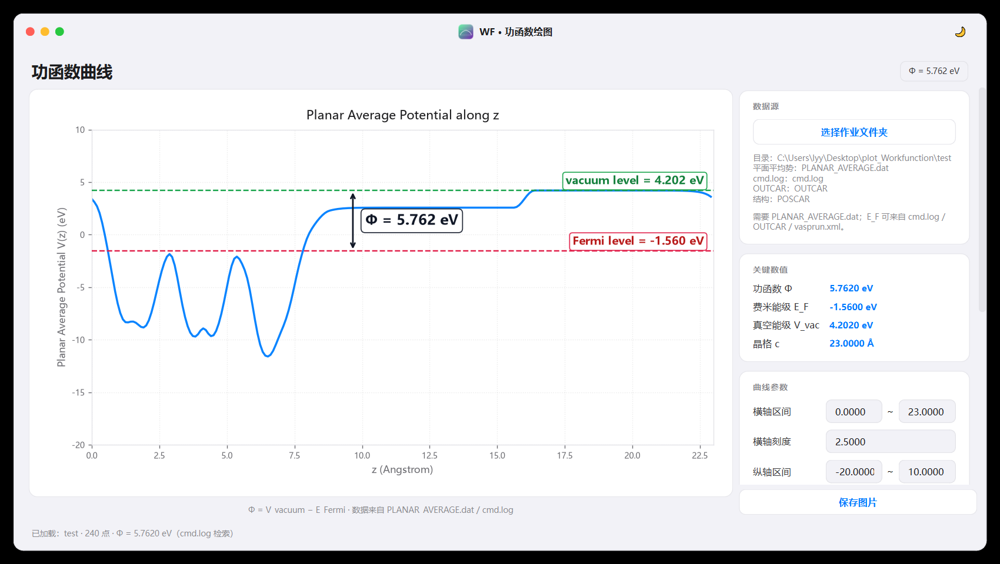
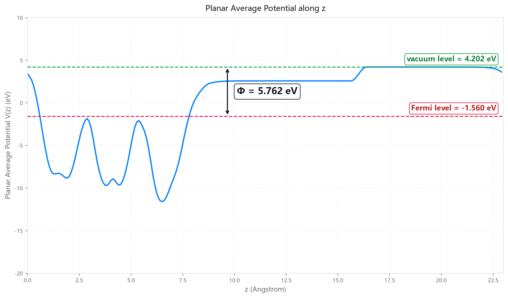

<div align="center">

# ⚡ WF · 功函数绘图工作台

**Work Function Viewer** — 一键把 VASP 功函数计算输出变成可发表级平面平均势曲线

[](https://www.python.org/)
[-41CD52?logo=qt&logoColor=white)](https://doc.qt.io/qtforpython/)
[](https://matplotlib.org/)
[](#-打包为-exe便携版)
[](LICENSE)
[](https://github.com/moyulyy/plot_Workfunction/releases)
[](https://github.com/moyulyy/plot_Workfunction/stargazers)

<i>iOS / macOS 风格桌面 GUI · 读取 vaspkit 426 平面平均势 · Φ = V_vac − E_F</i>

[⬇️ 下载便携版](../../releases/latest) · [📖 使用说明](#-使用指南) · [🐛 反馈问题](../../issues)

</div>

---

<div align="center">
  
  <br>
  <sub>左：平面平均势曲线（自动标注 Fermi level / vacuum level / Φ）　右：数据源与绘图参数</sub>
</div>

---

## ✨ 功能特性

| | |
| --- | --- |
| 📂 **一键加载** | 选择一次 VASP 作业文件夹，自动识别 `PLANAR_AVERAGE.dat`、`cmd.log`、`OUTCAR`、`vasprun.xml`、`POSCAR` |
| 📈 **专业制图** | 平面平均势 `V(z)` 曲线，自动标注 **Fermi level / vacuum level** 与功函数 **Φ** 双箭头 |
| 🎛️ **参数可调** | 横/纵轴区间与刻度、费米/真空能级、线宽、颜色、标注字号，实时重绘 |
| 🧮 **数值可靠** | 优先取 `cmd.log` 中 vaspkit 数值；缺失时按两端平台平均自动兜底计算 |
| 🎨 **深浅主题** | 标题栏一键切换深色 / 浅色，图表同步换色 |
| 🖼️ **高清导出** | 一键保存 PNG / PDF / SVG / JPEG（300 dpi），所见即所得 |
| 📦 **免安装便携版** | 提供 PyInstaller 打包脚本，生成可随意拷贝的独立 exe |

---

## 🔬 原理与数据来源

功函数定义为真空能级与费米能级之差：

```
Φ = V_vacuum − E_Fermi
```

计算与绘图流程（与 `Web_Probe` 后端及 `workfunction-bot` 约定一致）：

1. **VASP 单点自洽**：INCAR 打开 `LVHAR = .TRUE.`、`LDIPOL = .TRUE.`、`IDIPOL = 3`（配 `NSW = 0`、`IBRION = -1`），输出偶极校正的局域势 `LOCPOT`；
2. **vaspkit 426**（Potential Analysis）沿 **c 方向** 做平面平均，得到 `PLANAR_AVERAGE.dat`（`z(Å)` 与 `平面平均势(eV)`）；
3. 同时 `cmd.log` 会写入 `Vacuum-Level`、`Work Function`、`E-fermi`；
4. 本程序优先从 `cmd.log` 检索上述数值，检索不到时：

   - `E_F` 依次从 `OUTCAR`（`E-fermi :`）→ `vasprun.xml`（`<i name="efermi">`）读取；
   - `V_vac` 取曲线**两端平台中势能较高一侧**的平均（各取 1/10，至少 5 点）；
   - `Φ = V_vac − E_F`。

> [!NOTE]
> 采用与 `Web_Probe` 的 `_parse_planar_average` / `work_function_result` 相同的解析逻辑，
> 本程序得到的 Φ 与 Web_Probe 结果区、以及 vaspkit 打印的 `Work Function (eV)` 完全一致。

### 选择的作业文件夹需要包含

| 文件 | 必需 | 用途 |
| :--- | :---: | :--- |
| `PLANAR_AVERAGE.dat` | ✅ | 平面平均势曲线 `z, V(z)` |
| `cmd.log` | ⭐ 推荐 | `E-fermi` / `Vacuum-Level` / `Work Function` |
| `OUTCAR` | ⭕ 可选 | `cmd.log` 缺失时提供 `E_F` |
| `vasprun.xml` | ⭕ 可选 | `E_F` 的进一步兜底 |
| `POSCAR` / `CONTCAR` | ⭕ 可选 | 晶格 c 方向长度、原子数、化学式 |
| `LOCPOT` | ⭕ 可选 | 仅在数据源信息中展示 |

---

## 🚀 快速开始

### 方式一：下载便携版（无需 Python）

前往 [**Releases**](../../releases/latest) 下载 `WF-Viewer-v*-win64.zip`，
解压后双击 **`WF-Viewer.exe`** 即可运行。

> [!TIP]
> 也可以把作业文件夹直接作为参数传入：`WF-Viewer.exe "D:\path\to\workfunction"`，启动后自动加载。

### 方式二：从源码运行

```bash
# 1) 安装依赖
pip install -r requirements.txt

# 2) 启动 GUI
python wf_viewer.py
#   Windows 下也可双击：run_wf_viewer.bat

# 3) 可选：启动时自动加载某个作业文件夹
python wf_viewer.py ./test
```

> 环境要求：Python ≥ 3.9（已在 Python 3.14 + PySide6 6.11 上验证），Windows / Linux / macOS 均可。

---

## 📖 使用指南

1. 点击右栏 **「选择作业文件夹」**，选中包含 `PLANAR_AVERAGE.dat` 的 VASP 功函数作业目录；
2. 左栏立即显示平面平均势 `V(z)` 曲线：
   - 🟦 蓝色实线 —— 平面平均势 `V(z)`；
   - 🟥 红色虚线 —— 费米能级（标注 `Fermi level`）；
   - 🟩 绿色虚线 —— 真空能级（标注 `vacuum level`）；
   - ⬍ 双箭头 —— 功函数 `Φ = vacuum level − Fermi level`。
3. 右栏 **「关键数值」** 实时显示 Φ / E_F / V_vac / 晶格 c；
4. 右栏 **「曲线参数」** 可调整横/纵轴区间与刻度、费米/真空能级、线宽、颜色、标注字号，点击「重新绘制」生效；
5. 点击右下角 **「保存图片」** 导出 300 dpi 图片（PNG / PDF / SVG / JPEG）。

<div align="center">
  
  <br>
  <sub>导出效果：标题与坐标轴为英文，图例已省略，关键数值直接标注在图上</sub>
</div>

---

## 🧩 核心模块单独调用

`workfunction_core.py` 不依赖任何 GUI 库，可在脚本 / 终端中直接解析功函数数据：

```bash
python workfunction_core.py test
```

```text
数据点      : 240
E_F         : -1.5600 eV
V_vac       : 4.2020 eV
功函数 Φ    : 5.7620 eV
来源        : cmd.log
晶格 c      : 22.99999
体系        : O48Mn24Co6Co6（84 原子）
```

```python
from workfunction_core import load_workfunction, data_to_csv

data = load_workfunction("test")          # 目录或 PLANAR_AVERAGE.dat 路径
print(data["work_function"])              # 5.762
open("out.csv", "w", encoding="utf-8").write(data_to_csv(data))
```

---

## 📦 打包为 exe（便携版）

项目内置 PyInstaller 配置，可一键打包为免安装的 Windows 便携程序：

```bat
:: 方式一：双击一键打包脚本
build_portable.bat

:: 方式二：手动执行
pip install -r requirements-build.txt
pyinstaller --noconfirm --clean WF-Viewer.spec
```

产物：

```text
dist/WF-Viewer/
├── WF-Viewer.exe          ← 双击即可运行（约 8 MB）
├── assets/app.ico
├── README.md / 使用说明-便携版.txt
└── _internal/             ← 运行时依赖（PySide6 / matplotlib / numpy，约 180 MB）
```

整个 `WF-Viewer` 文件夹可随意拷贝到其它 Windows 电脑使用，**无需安装 Python**。

---

## 🗂️ 项目结构

```text
plot_Workfunction/
├── wf_viewer.py            # GUI 主程序（窗口、画布、左右两栏布局、交互）
├── workfunction_core.py    # 功函数解析与计算核心（无 GUI 依赖）
├── ui_kit.py               # iOS/macOS 风格 Qt 组件库
├── WF-Viewer.spec          # PyInstaller 打包配置
├── build_portable.bat      # 一键打包成便携程序包
├── run_wf_viewer.bat       # 源码启动脚本
├── requirements.txt        # 运行依赖
├── requirements-build.txt  # 打包依赖
├── 使用说明-便携版.txt      # 便携版随附说明
├── docs/                   # README 截图
├── assets/                 # 应用图标
└── test/                   # 示例作业（VASP 功函数计算输出）
    ├── PLANAR_AVERAGE.dat  #   平面平均势
    ├── cmd.log             #   Vacuum-Level 4.202 / Work Function 5.762
    └── OUTCAR / POSCAR / ...
```

---

## 📊 示例作业（`test/`）

| 项目 | 数值 |
| :--- | :--- |
| 体系 | O48Mn24Co6Co6（84 原子） |
| 晶格 c | 23.0000 Å |
| 数据点 | 240 |
| E_F | −1.5600 eV |
| V_vac | 4.2020 eV |
| **Φ（功函数）** | **5.7620 eV** |

结果与 `test/cmd.log` 中 vaspkit 打印的
`Vacuum-Level (eV): 4.202` / `Work Function (eV): 5.762` 完全吻合。

---

## ❓ 常见问题

<details>
<summary><b>提示「未找到 PLANAR_AVERAGE.dat」？</b></summary>

说明该目录尚未用 vaspkit **426** 沿 c 方向做过平面平均。请在含 `LOCPOT` 的目录执行：

```bash
echo -e "426\n3" | vaspkit      # 3 = c 方向
```

生成 `PLANAR_AVERAGE.dat` 后再加载即可。
</details>

<details>
<summary><b>Φ 与手算不一致？</b></summary>

程序会优先采用 `cmd.log` 中 vaspkit 打印的 `Vacuum-Level` 与 `Work Function`；
若 `cmd.log` 缺失，则用两端平台平均兜底。可在右栏「曲线参数」中手动微调
费米/真空能级，Φ 会随之更新。
</details>

---

## 📄 许可证

本项目采用 [MIT License](LICENSE) © 2026 lyy

<div align="center">
<br>
<i>如果这个项目对你有帮助，欢迎 ⭐ Star 支持一下！</i>
</div>
